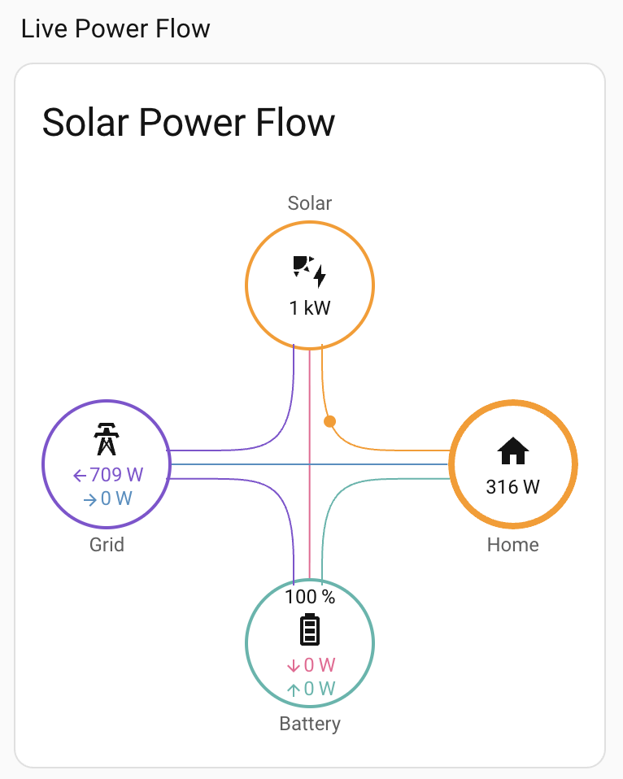

# Birdy — Home Assistant integration

Home Assistant integration for **Birdy**, the AI energy dashboard for GivEnergy
(powered by Shocking Energy).

This is Birdy's local-first route into Home Assistant. HA talks to your GivEnergy
inverter directly over your local network — **GivEnergy Cloud is not required** —
sends your system's live data up to your Birdy account, and adds **42 entities** to
HA (13 read-only sensors, 15 inverter controls, 6 battery diagnostics,
2 forecast values, 6 status/diagnostic entities) for use in dashboards and
automations.

## Two install modes

Since 0.11.0 Birdy supports two install modes — pick at first-run:

- **Cloud-attached (default)** — Birdy syncs your data to a Shocking Energy
  account. Unlocks the cloud dashboard at <https://app.shocking.energy>, the
  Birdy AI assistant, today's solar forecast + expected-daily-house values
  for automations, and multi-device data sharing (Pi + HA + phone seeing the
  same numbers).
- **Local mode** — tick the *Local mode* box on the intro screen. No account,
  no telemetry leaves your LAN. You get the same 40 Home Assistant entities
  (13 read sensors, 15 inverter controls, 6 battery diagnostics, 6 status
  diagnostics) and full local control. You don't get the cloud dashboard, the
  AI assistant, or the 2 forecast values. Swap to cloud mode later by
  re-adding the integration.

### Creating a Shocking Energy account (cloud mode)

Free to sign up — do this before (or during) install:

1. Go to <https://app.shocking.energy/#/signup>.
2. Enter your **email**, a **password** (min 8 characters), and your **name**.
3. Check your inbox and click the **confirmation link** in the email we send.
4. You're in. Now install the integration (below) and, when prompted, open the
   dashboard from a device on your home network and click **Adopt** to link HA
   to your account.

You can add your GivEnergy / Octopus API keys later from the dashboard — they're
optional for a Home Assistant install (HA reads your inverter locally). Already
have an account? Just sign in at <https://app.shocking.energy> instead.

## Requirements

- Home Assistant **2023.11.0** or newer (uses the `time` entity).
- LAN access from HA to the GivEnergy dongle on TCP **8899** (auto-discovered, or
  set manually).
- HA host clock within ±5 min of UTC — Birdy rejects readings whose timestamps
  are too far off. *Local mode is exempt from this requirement.*
- **Cloud mode only**: a Birdy account at <https://app.shocking.energy>.

## Install

### HACS (recommended)
1. In HA, go to **HACS** (left sidebar).
2. Top-right **⋮ menu → Custom repositories**.
3. Fill in:
   - **Repository:** `https://github.com/shocking-energy/hass-birdy`
   - **Type / Category:** **Integration**
4. Click **Add**, then close the dialog.
5. Back in HACS, search for **Birdy** → open it → click **Download**.
6. Confirm the version shown is **0.11.14** and download.
7. **Restart Home Assistant** (Settings → System → top-right ⋮ → Restart).
8. Add the integration: **Settings → Devices & Services → + Add Integration → search "Birdy"** → follow the setup prompts (bind to your tenant / inverter).

## First run — cloud mode (default)

1. Add the integration and click **Submit** (leave *Local mode* unchecked).
2. It scans the LAN for the dongle; if none is found, it asks for the inverter IP.
3. Open <https://app.shocking.energy> **from a device on the same network as HA**
   and click **Adopt** on the banner. This links the integration to your account.
4. Entities populate within ~10 s.

**If adoption doesn't complete:** linking works automatically when the browser you
open the dashboard in and your HA server are on the same internet connection. If
they're not — e.g. you're on mobile data, a VPN, or a CGNAT broadband setup — the
automatic link stops after 2 minutes. For now, open the dashboard from a device on
the same network as HA. A manual code option is planned.

## First run — local mode

1. Add the integration → tick **Local mode (no Shocking Energy account)** →
   click **Submit**.
2. It scans the LAN for the dongle; if none is found, it asks for the inverter IP.
3. Entities populate within ~10 s. No browser step, no banner — Birdy is
   already linked to your inverter.

Role diagnostic reads `local`; Account ID reads `local install`. The two
forecast sensors stay `unavailable` because no cloud is computing them.

## Set up the dashboard

A ready-made Lovelace dashboard is included at
[`dashboards/birdy-home.yaml`](dashboards/birdy-home.yaml) — live power flow,
energy distribution, the Battery mode + charge/discharge controls, and tiles for
every sensor.



**Installing the integration does not install this dashboard or its cards** — the
YAML is a template you paste in yourself, and the live flow diagram needs a
separate custom card. Set it up once:

1. **Install the flow card (prerequisite).** In HACS → **Frontend** → search
   **"Power Flow Card Plus"** → Download → **restart HA**. Without it the flow
   diagram shows a red *"custom element doesn't exist: power-flow-card-plus"*
   error.
2. *(Optional)* Configure HA's built-in **Energy dashboard** so the
   energy-distribution card has data.
3. **Create the dashboard.** Settings → **Dashboards** → **+ Add dashboard** →
   open it → top-right **✏️ Edit** → **⋮ → Raw configuration editor**.
4. **Paste** the full contents of
   [`dashboards/birdy-home.yaml`](dashboards/birdy-home.yaml) → **Save**.

## Entities

- **Read sensors (13)** — live grid / battery / solar / house power, plus
  today's energy totals. The energy sensors are tagged
  `device_class: energy` + `state_class: total_increasing`, so they drop straight
  into HA's Energy dashboard.
- **Inverter controls (15)** — **battery mode** (Eco / Timed export / Timed
  discharge), AC charge / DC discharge schedules, reserve / cutoff,
  charge / discharge rates, AC charge limit, max output %. All changes go
  straight to the inverter over your local network (no cloud round-trip). On
  GivEnergy Gen1/2, Eco and timed discharge/export are one mutually-exclusive
  setting, so they're surfaced as a single **Battery mode** select rather than
  separate switches.
- **Battery diagnostics (6)** — state of health, total capacity (kWh), calibrated
  and design capacity (Ah), pack voltage, pack temperature. Read off the BMS
  every poll cycle.
- **Forecast (2)** — today's expected solar (computed in the cloud from
  Open-Meteo + your install's learning factors) and your stated daily house
  consumption target. These feed the kiosk's `actual / expected` displays and are
  useful triggers for automations ("if tomorrow's expected solar is low, AC-charge
  to 80% tonight").
- **Diagnostics (6)** — role (master/monitor), last-published time, integration
  version, account ID, connected, publishing.

### Disabling controls

To remove all the control entities (switches/numbers/times) but keep the read
sensors + diagnostics, set this on the HA host and restart:

```
BIRDY_HA_CONTROLS_ENABLED=false
```

### Automatic peak export (optional)

On GivEnergy Gen1/2, *Timed export* holds the battery outside its window — so a
static "always export" setting leaves the house buying grid power all evening. The
**export scheduler** fixes that by flipping **Battery mode** automatically: *Timed
export* during your peak window, *Eco* (self-consume) the rest of the day. You sell
at peak **and** run the house off the battery in the evening.

It's **off by default**. Enable it on the **master** HA in either way, then restart:

- Create an empty marker file `<config>/.birdy_export_scheduler` (easiest on a
  `docker run` HA — `docker exec homeassistant touch /config/.birdy_export_scheduler`), **or**
- Set `BIRDY_EXPORT_SCHEDULER=1` in the HA container environment.

Set your export window with the **DC discharge** slot times, then leave **Battery
mode** to the scheduler. Changing the mode by hand pauses it for 2 hours.

## Master and monitor

Birdy lets only **one device per account send data at a time** — the *master*. Any
others are *monitors*.

- If another device (e.g. a Pi) is already the master, HA installs as a monitor:
  it won't send data, and instead displays the live figures it reads back from
  Birdy.
- To make HA the master, demote the existing one at <https://admin.shocking.energy>,
  then reload the integration.

HA's current role is shown in its diagnostic entities.

## Security

- Each account is private — this install can only ever read and write your own
  data.
- HA stores a login token for Birdy in its config entry (standard HA behaviour;
  held unencrypted in `.storage/core.config_entries`). The token only lets this
  install publish its own data.
- Inverter controls are sent directly over your local network. Anything on that
  network can reach the inverter, so **securing your LAN is your responsibility**.

## Reporting issues

<https://github.com/shocking-energy/hass-birdy/issues> — include HA Core
version + install type, GivEnergy model, integration version
(`sensor.birdy_ha_integration_version`), whether controls are enabled, and logs
filtered to `custom_components.birdy_ha`.

---

Powered by Shocking Energy · Maintenance by TEMS Solar
